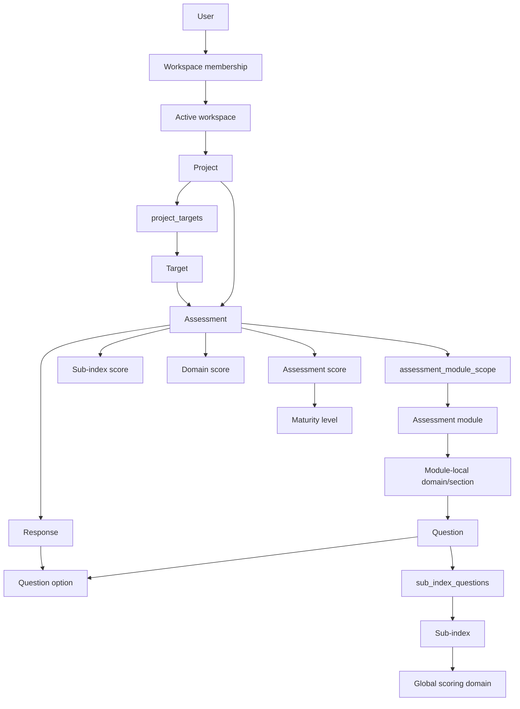

# Current Architecture

## Audit status

Phase 21 read-only audit, 17 July 2026. The implementation described here is the current working tree at commit `c190e419108bb2483febcea755fe30c13b7348fe`, including pre-existing uncommitted changes. The branch is `master`, one commit ahead of `origin/master`. No application code, migration, test, configuration, or data was changed during this audit.

The full regression suite was not run because regression-baseline execution belongs to Phase 22. Read-only discovery found 312 declared tests and 312 entries in PHPUnit's result cache, but that cache also contains 93 defect entries and is not evidence of a green run.

## Runtime stack

| Layer | Current implementation |
|---|---|
| Framework | Laravel 13.20.0 on PHP 8.3.31 |
| Server UI | Blade components and views |
| Stateful UI | Livewire 4.3 components |
| Browser behavior | Alpine.js supplied by Livewire; minimal application JavaScript |
| Styling | Tailwind CSS 4 with CSS-first tokens in `resources/css/app.css` |
| Data access | Eloquent plus direct query-builder access |
| Production-intent database | PostgreSQL, represented by `docker-compose.yml` |
| Current local and test database | SQLite (`.env`, `.env.example`, and `phpunit.xml`) |
| Auth | Laravel Breeze, email/password |
| Email | Resend, gated by a platform setting |
| PDF | DomPDF |
| Payments | Paystack and Flutterwave webhook controllers |
| Identifiers | Mixed: UUIDs for tenant/business records, integers for most reference records, strings for some codes/tokens |

## Logical topology

The effective hierarchy is therefore not the documented one-target foreign key model. `projects` and `targets` are related through `project_targets`, while controllers and views normally use only the first attached target. Assessments reference both a project and a target.

## Application modules and responsibilities

### Identity, workspaces, and tenancy

- Registration creates a user, workspace, OWNER membership, and active-workspace assignment in one transaction.
- `ResolveWorkspace` loads `users.active_workspace_id` into the application container.
- `BelongsToWorkspace` and `WorkspaceScope` are used only by `Project` and `Target`.
- Assessments, responses, scores, consent, respondent tokens, membership, invitations, and other downstream records do not carry the documented global workspace scope. Controllers often recover isolation through a workspace-scoped project or explicit ownership check.
- No `app/Policies` directory exists. The documented policy layer is not implemented.
- Platform administration is protected by `EnsurePlatformAdmin` and the `PLATFORM_ADMIN` user role. A `CURATOR` helper exists on `User`, but there is no curator route group or curator middleware.

### Projects and targets

- A project is workspace-scoped and owned by a user.
- Project creation also creates a target and attaches it through `project_targets` in one transaction.
- Schema permits many targets per project; current UX and downstream logic use `targets->first()` as the practical primary target.
- Target types, categories, countries, regions, and sub-regions drive module availability and default module selection.

### Assessment framework and content

- `assessment_modules` is the platform module catalogue, despite documentation using that name for an assessment-to-module join.
- `module_domains` are module-local questionnaire sections. They are distinct from global `domains`, which are scoring dimensions.
- Questions belong directly to a module and optional module-local domain.
- Questions connect to sub-indices through `sub_index_questions`; option rows carry score values.
- French question and option overlays are stored in translation tables.
- Module/question administration edits shared master records in place. There is no published-content immutability or version boundary.

### Assessment creation and runners

- The committed baseline created an assessment from one module.
- The current uncommitted worktree changes this to select multiple modules, record excluded default modules with reasons, and assign `FULL_TARGET` or `MODULE_PICKER` scope.
- The authenticated Livewire runner loads all in-scope modules.
- The public runner resolves only the first in-scope module for an assessment token.
- Both runners currently persist option responses only. Numeric, text, ranking, and true multi-select interaction paths are not implemented.

### Scoring

- Submission invokes `ScoringService` synchronously.
- The current scorer reads only assessor-authored responses (`respondent_id IS NULL`). The approved direction is to extend this same versioned scorer with explicit respondent-role semantics; a separate reporting engine is prohibited.
- Sub-index score = weighted mean of answered option values for linked scored questions.
- Domain score = unweighted mean of non-null sub-index scores.
- Overall score = unweighted mean of all non-null sub-index scores.
- Score status is `NOT_CALIBRATED`, `PARTIAL`, or `CALIBRATED`.
- Bands are Weak `<45`, Moderate `45-69.99`, Strong `>=70`.
- Maturity is assigned from five configured ranges.
- `domain_weights`, topic scoring, corroboration, project rollups, clinical-quality score fields, root-cause tables, and recommendation tables are not used by the active scoring path.

### Results and reporting

- Results are assembled on demand from assessment, score, domain-score, and sub-index-score records.
- The Reports navigation opens a workspace-scoped index of completed assessments and reuses the standard final result, PDF, and governed share-link routes.
- Findings are generated as presentation text from low or null sub-index scores; they are not persisted first-class findings.
- Reports are Blade views, browser print output, DomPDF downloads, project CSV streams, and temporary signed public URLs.
- There is no `reports` or `report_sections` table/model in the implementation.
- Progress and comparison pages compare completed assessments within a project.
- Current uncommitted history grouping uses `scope_type`, which does not prove that two runs used the same module composition.

### Plans, settings, and integrations

- Workspace plan limits are centralized in `PlanService` and partly configurable through `platform_settings`.
- Feature access is stored in the `plan_features` matrix and administered by platform admins.
- Email delivery is gated by `email.notifications_enabled`; database notifications remain active.
- Paystack is excluded from CSRF validation and validates HMAC signatures.
- Flutterwave validates a configured hash, but its webhook route is not in the CSRF-exception list.

## HTTP and UI architecture

- Route discovery reports 80 application routes: 66 authenticated and 14 public.
- There is no `routes/api.php` and no versioned REST/JSON API.
- External interfaces are HTML forms, Livewire update requests, two payment webhooks, Resend's package webhook, temporary signed reports, invitation links, and respondent-token links.
- The authenticated shell uses a desktop sidebar and mobile bottom navigation.
- Admin has a separate Blade layout.
- Core reusable visual components include score arcs/pills, navigation items, plan gates, buttons, inputs, modals, skeletons, and the Vytte mark.
- Dark mode is user-persisted. Authenticated runner UI uses translation keys; public-runner copy remains hard-coded.
- The sidebar contains a non-functional `Reports` link (`href="#"`).

## Source organization

| Area | Current shape |
|---|---|
| Models | 29 Eloquent models; several migrated tables have no model |
| Controllers | Conventional controllers plus an admin namespace |
| Livewire | Two runner components |
| Services | `ScoringService` and `PlanService` |
| Migrations | 29 files creating 60 application/infrastructure tables |
| Views | 69 Blade files |
| Tests | 33 files, 312 declared tests |
| Product documentation | Architecture, schema, UI rules, phases, and only one detailed module specification |

## Architectural conclusion

Vytte is a modular Laravel monolith with reusable questionnaire content and a workable assessment runtime. It already contains several seams suitable for a template layer: module catalogue, assessment-module scope, question assets, translations, and assessment-bound responses/scores. It does not yet have the immutability, version identity, snapshot, or composition-fingerprint guarantees required for safe templates. Those can be added incrementally, but only after Phase 22 establishes a trustworthy baseline and Isaac resolves the pending decisions in `DECISION_LOG.md`.
