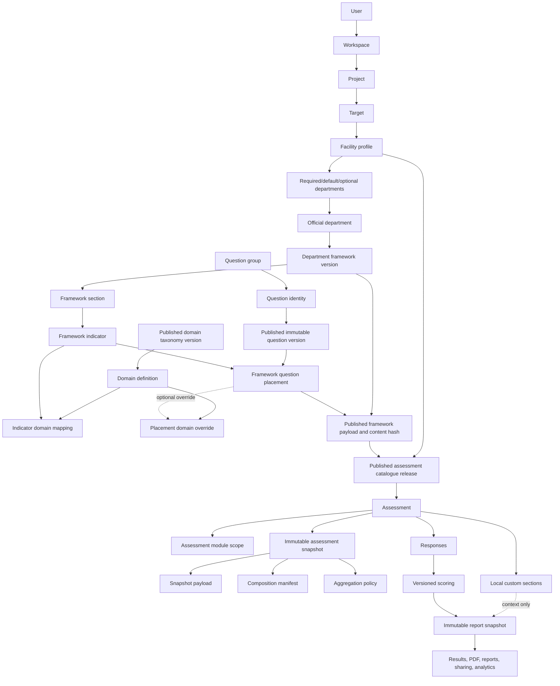

# Current Architecture

## Status

This document describes the implemented Vytte platform-governed composition architecture, including the reusable question-bank layer added after the original composition work.

Verified locally:

- `php artisan test`: 401 tests, 1097 assertions passing. Full sequential PostgreSQL run, 2026-07-19, commit `65648e5`.
- Clean disposable PostgreSQL `migrate:fresh --seed`: passing.
- Production frontend build with `npm.cmd run build`: passing.

PostgreSQL is the database authority for local development, automated tests, release verification, and production.

## Runtime Stack

| Layer | Implementation |
|---|---|
| Framework | Laravel 13 on PHP 8.3+ |
| UI | Blade, Livewire 4, Alpine.js |
| Styling/build | Tailwind CSS 4 and Vite |
| Data access | Eloquent plus bounded query-builder operations |
| Production database | PostgreSQL |
| Local/test database | PostgreSQL |
| Auth | Laravel Breeze email/password |
| PDF | DomPDF |
| Payments | Paystack and Flutterwave webhooks |

## Core Product Rule

Vytte is the authority for official assessment content. Workspaces consume published Vytte catalogue releases; they do not create official departments, official framework versions, official scoring rules, or official aggregation policy.

There are exactly two assessment creation paths:

- **Comprehensive Health Assessment:** a composition orchestrator for a facility profile.
- **Focused Health Assessment:** a single health domain, programme, topic, or intervention.

## Logical Topology

## Platform Content Model

Official departments live in `assessment_modules`.

### Question Bank

Official question content is separated into identity, immutable version, and framework-specific placement. Questions are never generated from domains; domains remain downstream analysis. `QUESTION_BANK_ARCHITECTURE.md` is the detailed reference.

| Concept | Table | Role |
|---|---|---|
| Question group | `question_groups` | Organizes reusable question identities inside a department or focused scope. Replaced the removed `module_domains`. |
| Question identity | `questions` | Stable reusable question concept and stable code. Not the assessment payload by itself. |
| Question version | `question_versions` | Immutable wording, response type, options, numeric config, numeric bands, methodology metadata, and content hash. |
| Framework section | `framework_sections` | Ordered grouping inside one framework version. |
| Framework indicator | `framework_indicators` | Measurement objective inside a section. Carries analytical-domain mappings. |
| Framework placement | `framework_question_placements` | Binds one exact published question version into a section and indicator with order, required state, evidence expectation, weight, scoring contribution, criticality, and framework-specific display wording. |

A question version may be placed in more than one framework, with different wording, weight, and analytical meaning per placement.

Question versions move through `DRAFT`, `INTERNAL_REVIEW`, `APPROVED`, `PUBLISHED`, and then `SUPERSEDED` or `ARCHIVED`. Published, superseded, and archived versions are immutable and cannot be deleted. Supersession clones the content into a successor draft linked by `parent_version_id` and leaves the predecessor reproducible.

### Framework Versions

Each official department can have independently published immutable rows in `department_framework_versions`. Publication validates that every placed question version is published, that response types are supported, that open text is never scored, that scored numeric placements have frozen bands, that scored options carry weights, that every scored placement belongs to the scoring profile, and that analytical-domain mappings reference a published taxonomy version.

A published framework version freezes:

- department identity;
- sections, indicators, and exact question-version placements;
- rendered question text, options, numeric configuration, and numeric bands;
- analytical-domain routing and the scoring profile;
- evidence and critical-failure metadata;
- provenance and licence metadata;
- scoring algorithm version;
- exact published payload;
- content hash.

Published department framework versions cannot be edited or deleted. Corrections require a new version.

### Analytical Domains

Analytical domains are governed through `domain_taxonomies`, `domain_taxonomy_versions`, and `domain_definitions`. Routing attaches at the indicator through `framework_indicator_domain_mappings`, and a placement may override it through `framework_question_placement_domain_overrides`. A placement may have only one primary domain. The platform must never reintroduce `module_domains`.

## Facility Profiles

Official facility profiles live in `facility_profiles`.

Examples in the demonstration seed:

- Clinic
- Primary Health Centre
- General Hospital

`facility_profile_departments` defines whether each department is:

- `REQUIRED`
- `DEFAULT`
- `OPTIONAL`
- unavailable by omission

Required departments cannot be removed. Default departments are preselected and may be removed with a reason when policy allows. Optional departments are available but not preselected.

## Assessment Catalogue

Published catalogue releases live in `assessment_catalogue_releases`.

A catalogue release pins:

- one creation path;
- one facility profile for comprehensive assessments, or one health domain for focused assessments;
- exact published department framework versions;
- department applicability;
- display order and labels;
- aggregation policy;
- composition rules;
- content hash and publication audit.

The system never resolves "latest framework version" at assessment creation time. It resolves only through a published catalogue release.

## Assessment Creation

Assessment creation uses `AssessmentCreationService::createFromCatalogue`.

The service:

1. Verifies the catalogue release is published.
2. Verifies facility-profile compatibility for comprehensive assessments.
3. Applies required/default/optional department rules.
4. Rejects invalid departments and duplicate questions.
5. Builds one composed snapshot payload from the pinned framework versions.
6. Freezes a composition manifest containing release ID, release hash, facility profile, selected framework version IDs, selected hashes, and exclusions.
7. Stores one immutable `assessment_snapshots` row.
8. Stores included/excluded rows in `assessment_module_scope`.

Duplicate question identities are rejected at composition because responses are keyed by question identity rather than by placement. See `DECISION_LOG.md` DEC-2026-07-19-011.

The assessment snapshot is immutable once created, enforced by a model guard. Its payload, composition manifest, aggregation policy, collection config, and content hash cannot be rewritten. See `DECISION_LOG.md` DEC-2026-07-19-012.

The legacy assessment template tables were removed with the legacy template architecture. Assessment creation resolves only through published catalogue releases.

## Runtime

The authenticated runner reads the immutable assessment snapshot. It supports:

- scalar option questions;
- open-text questions;
- numeric questions with frozen unit, bounds, and step;
- optional response-bound evidence notes.

Unsupported response types cannot be published into official framework versions.

External respondent collection remains in the same assessment architecture. It uses durable public response sessions, independent session scoring, threshold review, manual finalization, and the ordinary immutable report.

## Scoring

Scoring reads only official snapshot payload. Local custom sections never enter official score calculation.

Current algorithm:

- `vytte-4.0-numeric-bands`
- canonical output scale: 0-100
- weighted sub-index means
- domain and overall means of non-null scored results
- null means uncalibrated, never zero

The demonstration aggregation method is `MEAN_OF_SCORED_SUB_INDICES`.

Catalogue aggregation policy can enable critical failures. The current implementation supports an initial demo rule where a configured critical failure can force the overall score to zero and mark calibration as `CRITICAL_FAILURE`.

## Reporting

Completion creates one immutable `assessment_report_snapshots` payload with a schema version and content hash.

Results, PDF, reports index, shared reports, CSV, and progress views use the same report architecture. There is no separate community, respondent, or custom report subsystem.

## Local Custom Sections

Workspace users may create local custom sections attached to an assessment. These sections:

- belong only to the workspace;
- are visibly local;
- cannot change official content;
- cannot replace official questions;
- are excluded from official scoring;
- may capture local notes, questions, observations, instructions, and evidence prompts.

## Authorization and Audit

- Workspace access is enforced through active workspace membership, scoped project/target ownership, and policies.
- Vytte Platform Admin authority is separate from workspace roles.
- Publication, assessment creation, completion, report finalization, respondent-link lifecycle, share-link lifecycle, department-framework publication, and catalogue publication are auditable events.

## Current Boundaries

- The seeded governed catalogue is demonstration-only.
- A Platform Admin control center exists for official content, publication, roles, workspace oversight, share-link control, and audit review.
- Facility profile selection exists during project creation; profile editing after project creation is not yet exposed.
- PostgreSQL parity and concurrency verification remain release gates.
- Additional response types require renderer, storage, validation, completeness, snapshot, and scoring contracts before publication.
