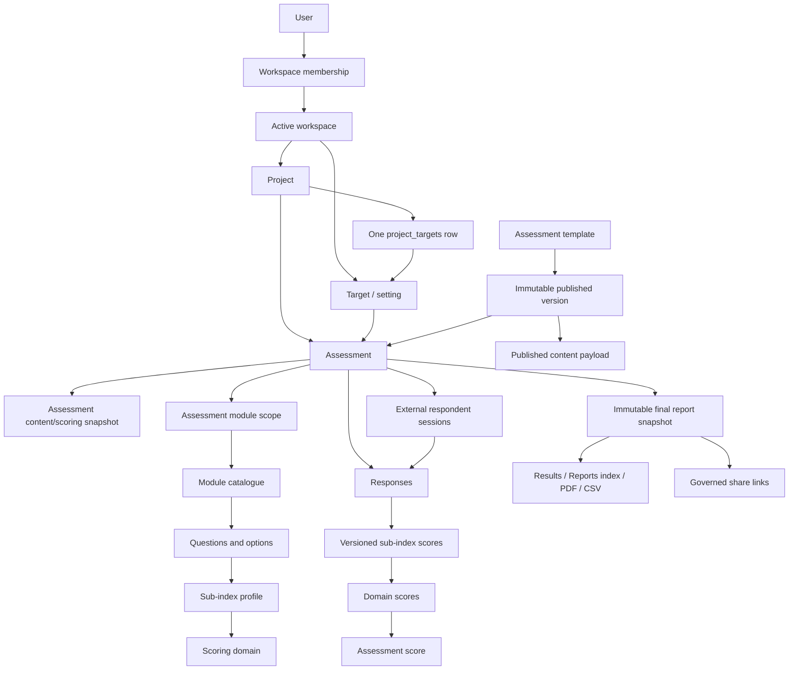

# Current Architecture

## Status

This document describes the implemented Laravel monolith after the approved Phase 21/22 remediation through Module 16. Repository migrations, models, services, policies, routes, and tests are the technical source of truth.

Current verified SQLite boundary: 365 tests and 870 assertions passing. PostgreSQL remains the production authority; parity verification is pending restoration of the local PostgreSQL/Docker environment.

## Runtime stack

| Layer | Implementation |
|---|---|
| Framework | Laravel 13 on PHP 8.3+ |
| Server UI | Blade layouts, views, and components |
| Stateful UI | Livewire 4 |
| Browser behavior | Alpine.js supplied by Livewire plus minimal application JavaScript |
| Styling/build | Tailwind CSS 4, CSS-first tokens, Vite |
| Data access | Eloquent plus bounded query-builder operations |
| Production database | PostgreSQL |
| Local/test database | SQLite, including in-memory PHPUnit runs |
| Auth | Laravel Breeze email/password |
| Email | Resend behind platform settings |
| PDF | DomPDF |
| Payments | Paystack and Flutterwave webhooks |
| Identifiers | Mixed UUID, integer, string, and composite keys |

## Logical topology

## Tenancy and authorization

- Registration creates a user, workspace, OWNER membership, and active-workspace assignment transactionally.
- `ResolveWorkspace` accepts an active workspace only when the authenticated user has membership. It runs before route binding.
- Projects and targets carry direct workspace ownership and fail-closed global scoping.
- Project and Assessment policies protect active project, assessment, result, export, progress, sharing, and respondent-link actions.
- Downstream rows inherit authority through their project/assessment relationship. New tenant-owned routes must combine a workspace-scoped parent query with policy authorization.
- Platform-admin and curator middleware are separate. Curators may publish validated template versions through the governed publication route.

## Project and setting model

- A project belongs to one workspace and one owner.
- Project creation creates/attaches one target (the assessed setting) in the same transaction.
- The compatibility `project_targets` junction remains, but a unique database constraint enforces one target per project.
- Settings include health facilities and user-relevant contexts such as schools, communities, correctional facilities, workplaces, places of worship, NGOs/programmes, government organizations, and custom settings.
- Setting taxonomy and health-domain taxonomy are separate. A setting does not make Vytte a non-health vertical.

## Template and content architecture

- Vytte has exactly two creation paths: comprehensive and focused.
- Comprehensive templates declare a setting and may include multiple assessment areas. Users may exclude non-applicable areas with a reason.
- Focused templates declare one health domain and one direct assessment scope. They never load unrelated batteries or module checklists.
- Template publication validates provenance, licence metadata, supported response types, active questions, option weights, and scored-question mappings.
- A published version stores the exact payload represented by its content hash and is immutable.
- Assessment creation copies the selected published payload into an assessment-owned immutable snapshot, including presentation, consent applicability, and scoring profile.
- Master module/question assets remain curator-editable for future drafts; edits cannot change existing published versions or snapshot-based assessments.

## Assessment runtime

- The authenticated runner reads the assessment snapshot when present and falls back to live content only for legacy assessments.
- The runner supports scalar option inputs and unscored open text under the publishable contract.
- Required scored answers are validated on the server before completion.
- Optional evidence is progressively disclosed and stored as `responses.evidence_note` on the exact response. It does not count as an answer or create a repository workflow.
- External respondent links create durable, resumable sessions with locale, consent, activity, and submission timestamps. Tokens record creator, use, expiry, and revocation.
- External and authenticated runners load all in-scope modules and revalidate question/option authority on every write.
- Respondent-aware scoring semantics must extend the shared versioned scoring/report contract. A separate community or respondent report is prohibited.

## Lifecycle

- Assessment execution: `IN_PROGRESS -> COMPLETE`, terminal.
- Included area execution: `PENDING -> COMPLETED`.
- Excluded comprehensive areas: `EXCLUDED`.
- Template/version publication: `DRAFT -> PUBLISHED`; published versions are immutable.
- Reopen, correction-version, cancellation, retirement, and archive workflows are not implemented.

See `LIFECYCLE_STATE_MACHINE.md`.

## Scoring

- Completion invokes `ScoringService` synchronously inside the completion transaction.
- Published-template assessments use the frozen scoring profile; legacy assessments use a separated compatibility profile.
- Option scales with a maximum at or below 1 are normalized to canonical 0–100 output.
- Sub-index results are weighted means of answered scored questions.
- Domain and overall results aggregate non-null sub-index results.
- Calibration is `NOT_CALIBRATED`, `PARTIAL`, or `CALIBRATED`.
- Display bands are Weak below 45, Moderate from 45 to below 70, and Strong at 70 or above.
- Every stored score records an algorithm version. Completed assessments are not silently recalculated.
- The current compatibility scorer calculates assessor-authored response rows. Explicit multi-respondent aggregation remains a template/scoring-profile extension gap, not a reason for a parallel engine.

## Reporting

- Completion persists one immutable structured report snapshot with schema version and SHA-256 content hash.
- Results, PDF, public shared reports, and progress history read the final snapshot for newly completed assessments.
- Legacy completed assessments use a clearly separated best-effort builder and are not silently backfilled.
- The Reports index lists completed assessments in the active workspace and reuses the standard results, PDF, share-link, and revocation actions.
- Governed report links record creator, expiry, active/revoked state, use count, and last-used time. Legacy temporary signed routes remain readable for compatibility.
- Progress comparisons require matching composition fingerprints; incompatible assessments are rejected.
- Findings remain derived presentation text. Root-cause and recommendation tables are dormant and do not represent implemented product behavior.

## Governance and audit

- Immutable audit records cover template publication, assessment creation/completion, final-report capture, respondent-link lifecycle, and report-link lifecycle.
- Plan limits and feature access are centralized in `PlanService` and `plan_features`.
- Community assessment content is not a separate plan feature.
- Email is gated by platform settings; database notifications remain available.
- Paystack and Flutterwave webhook endpoints are CSRF-exempt and retain provider-specific signature/hash validation.

## HTTP and UI architecture

- The product surface is server-rendered HTML, Livewire requests, payment/email webhooks, invitation links, respondent-token links, and governed report links.
- There is no generic versioned REST/GraphQL API because no approved consumer requires one.
- The authenticated shell provides Dashboard, Projects, Assessments, Reports, Modules, Team, and Notifications.
- Reusable UI includes app/guest/admin layouts, navigation items, buttons and form controls, score arcs/pills, plan gates, modals, skeletons, and the Vytte mark.
- Ocean Blue tokens in `resources/css/app.css` are authoritative. Interfaces support dark mode and responsive layouts.

## Known bounded gaps

- PostgreSQL parity and concurrency checks remain a release gate.
- Respondent-aware aggregation needs an explicit template-level scoring unit and completion rule inside the shared engine.
- Numeric, true multi-select, ranking, observation, and other declared response types remain unavailable for publication.
- Dataset counts require governed version metadata; sample content is not production clinical authority.
- Dormant recommendation, root-cause, topic-score, project-score, observation, and multi-select structures remain reserved.
- No assessment reopen/correction/archive workflow exists.

## Architectural conclusion

Vytte is a modular, workspace-scoped Laravel monolith with one template, assessment, scoring, and reporting architecture. The safe extension path is additive and contract-driven: publish immutable template content, create assessment snapshots, collect validated responses, calculate versioned scores, and finalize one immutable report. New settings, respondent roles, evidence support, and future response types must reuse that path rather than create parallel products.
