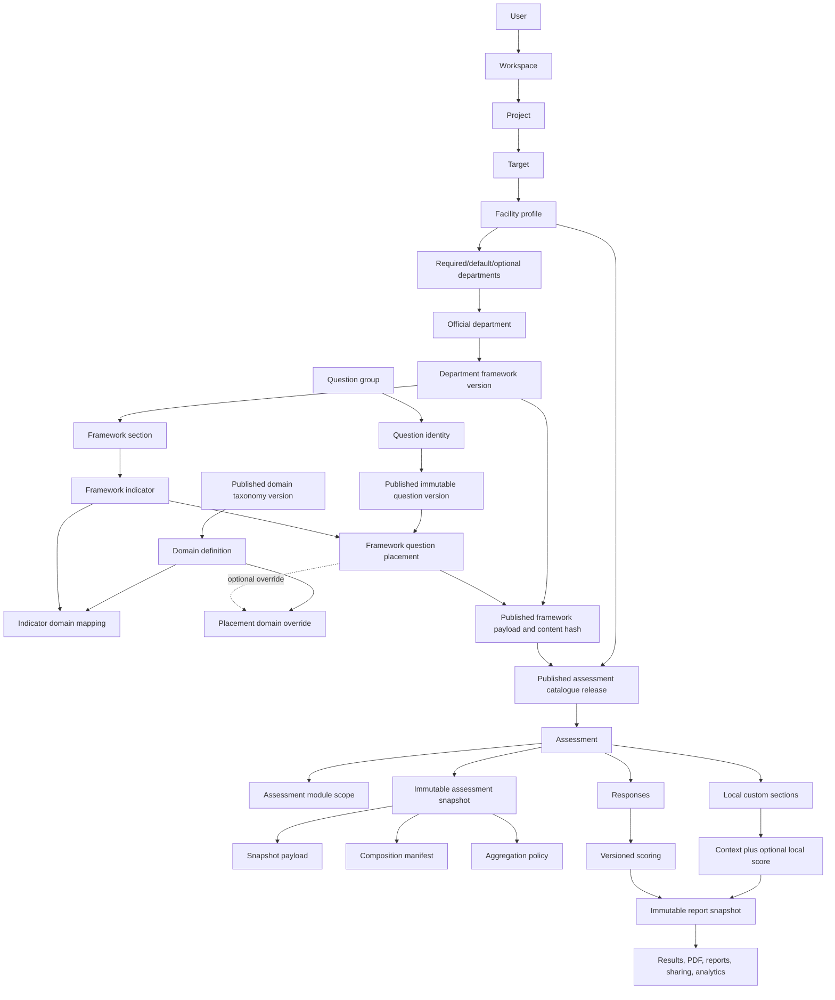

# Current Architecture

## Status

The implementation and user-access evidence for the fourteen-part assessment governance contract is recorded in `ASSESSMENT_GOVERNANCE_IMPLEMENTATION_AUDIT.md`.

This document describes the implemented Vytte platform-governed composition architecture, including the reusable question-bank layer added after the original composition work.

Release verification requires one full sequential PostgreSQL suite, a clean official seed validation,
Pint, compiled Blade views, and the production frontend build. The most recent full-suite audit passed
on 2026-08-15. Test counts are release evidence, not architecture contracts, and belong in
`TEST_COVERAGE_REVIEW.md` rather than being frozen here.

PostgreSQL is the database authority for local development, automated tests, release verification, and production.

## Runtime Stack

| Layer | Implementation |
|---|---|
| Framework | Laravel 13 on PHP 8.3+ |
| UI | Blade, Livewire 4, Alpine.js |
| Styling/build | Tailwind CSS 4 and Vite |
| Data access | Eloquent plus bounded query-builder operations |
| Production database | PostgreSQL |
| Local/test database | PostgreSQL |
| Auth | Laravel Breeze email/password |
| PDF | DomPDF |
| Payments | Paystack and Flutterwave webhooks |

## Core Product Rule

Instrument publishers are accountable for content purpose, methodology, and scoring claims. Vytte is the authority for publisher identity, provenance, review state, technical validation, immutable versions, audit, reproducibility, secure delivery, and comparison eligibility. Existing Vytte catalogue content remains available through the same governed release architecture.

There are exactly two assessment creation paths:

- **Comprehensive Health Assessment:** a composition orchestrator for a facility profile.
- **Focused Health Assessment:** a single health domain, programme, topic, or intervention.

## Logical Topology

```mermaid
flowchart TD
    U[User] --> W[Workspace]
    W --> P[Project]
    P --> T[Target]
    T --> FP[Facility profile]

    QG[Question group] --> QI[Question identity]
    QI --> QV[Published immutable question version]
    AM[Official department] --> DFV[Department framework version]
    DFV --> SEC[Framework section]
    SEC --> IND[Framework indicator]
    IND --> PL[Framework question placement]
    QV --> PL
    IND --> DM[Indicator domain mapping]
    PL -.optional override.-> DO[Placement domain override]
    DTV[Published domain taxonomy version] --> DD[Domain definition]
    DD --> DM
    DD --> DO

    PL --> PUB[Published framework payload and content hash]
    DFV --> PUB

    FP --> FPD[Required/default/optional departments]
    FPD --> AM

    PUB --> CR[Published assessment catalogue release]
    FP --> CR
    CR --> A[Assessment]
    A --> AMS[Assessment module scope]
    A --> ASN[Immutable assessment snapshot]
    ASN --> PAY[Snapshot payload]
    ASN --> MAN[Composition manifest]
    ASN --> AGG[Aggregation policy]

    A --> R[Responses]
    R --> SCORE[Versioned scoring]
    SCORE --> REP[Immutable report snapshot]
    REP --> OUT[Results, PDF, reports, sharing, analytics]

    A --> LCS[Local custom sections]
    LCS --> LS[Context plus optional local score]
    LS --> REP
```

## Platform Content Model

Official departments live in `assessment_modules`.

### Question Bank

Official question content is separated into identity, immutable version, and framework-specific placement. Questions are never generated from domains; domains remain downstream analysis. `QUESTION_BANK_ARCHITECTURE.md` is the detailed reference.

| Concept | Table | Role |
|---|---|---|
| Question group | `question_groups` | Organizes reusable question identities inside a department or focused scope. Replaced the removed `module_domains`. |
| Question identity | `questions` | Stable reusable question concept and stable code. Not the assessment payload by itself. |
| Question version | `question_versions` | Immutable wording, response type, options, numeric config, numeric bands, methodology metadata, and content hash. |
| Framework section | `framework_sections` | Ordered grouping with purpose, respondent instructions, estimated time, intended role, and repeatable-section metadata. |
| Framework indicator | `framework_indicators` | Measurement objective inside a section. Carries analytical-domain mappings. |
| Framework placement | `framework_question_placements` | Binds one exact published question version into a section and indicator with order, required state, evidence expectation, weight, scoring contribution, criticality, and framework-specific display wording. |

A question version may be placed in more than one framework, with different wording, weight, and analytical meaning per placement.

Placement applicability uses a versioned response-rule grammar. Rules may inspect only earlier questions and combine up to ten conditions with `ALL` or `ANY`; this prevents cycles and makes evaluation deterministic. The same evaluator controls authenticated and external rendering, submission completeness, and scoring. Hidden questions do not enter the applicable denominator, even if a previous path left a durable answer. Authors test branching in a no-save simulator before publication.

### Publishers and governance claims

`content_publishers` records the accountable publisher independently from the underlying source authority. Questions, framework versions, and catalogue releases carry a publisher and distribution level. `content_governance_claims` records independent source, licence, subject, methodology, scoring, field-test, translation, and benchmark review states. Publisher identity verification never implies those content reviews.

Existing content is backfilled to the verified Vytte publisher. New assessment-builder drafts choose publisher and source in a dedicated guided step. Publisher metadata is frozen into newly published framework payloads and assessment composition manifests.

Workspace experts may submit candidate questions through `content_contributions`. Submissions remain tenant-private and never enter a runner or catalogue directly. Platform review may return, reject, or accept a contribution; only an accepted contribution can be promoted, and promotion creates a private, unscored draft question version that must pass the ordinary governance and publication workflow.

The assessment builder includes a quality-review step. Deterministic lint and optional AI review write source-hashed `content_assistance_runs`; both are advisory and neither can mutate, approve, score, or publish content. Independent evidence-backed claims are recorded against the framework version with their reviewer and optional expiry.

Question versions move through `DRAFT`, `INTERNAL_REVIEW`, `APPROVED`, `PUBLISHED`, and then `SUPERSEDED` or `ARCHIVED`. Published, superseded, and archived versions are immutable and cannot be deleted. Supersession clones the content into a successor draft linked by `parent_version_id` and leaves the predecessor reproducible.

### Framework Versions

Each official department can have independently published immutable rows in `department_framework_versions`. Publication validates that every placed question version is published, that response types are supported, that open text is never scored, that scored numeric placements have frozen bands, that scored options carry weights, that every scored placement belongs to the scoring profile, and that analytical-domain mappings reference a published taxonomy version.

A published framework version freezes:

- department identity;
- sections, indicators, and exact question-version placements;
- rendered question text, options, numeric configuration, and numeric bands;
- analytical-domain routing and the scoring profile;
- evidence and critical-failure metadata;
- provenance and licence metadata;
- scoring algorithm version;
- exact published payload;
- content hash.

Published department framework versions cannot be edited or deleted. Corrections require a new version.

### Analytical Domains

Analytical domains are governed through `domain_taxonomies`, `domain_taxonomy_versions`, and `domain_definitions`. Routing attaches at the indicator through `framework_indicator_domain_mappings`, and a placement may override it through `framework_question_placement_domain_overrides`. A placement may have only one primary domain. The platform must never reintroduce `module_domains`.

## Facility Profiles

Official facility profiles live in `facility_profiles`.

Examples in the official seed:

- Clinic
- Primary Health Centre
- General Hospital

`facility_profile_departments` defines whether each department is:

- `REQUIRED`
- `DEFAULT`
- `OPTIONAL`
- unavailable by omission

Required departments cannot be removed. Default departments are preselected and may be removed with a reason when policy allows. Optional departments are available but not preselected.

## Assessment Catalogue

Published catalogue releases live in `assessment_catalogue_releases`.

During beta, every published catalogue release is available to every workspace without a plan,
publisher, or catalogue-entitlement restriction. Draft, archived, and superseded releases remain
unavailable. Comprehensive releases must still match the project's setting and facility profile;
every published focused release is available for any setting. This universal beta access is a
commercial availability decision, not a relaxation of publication, compatibility, or snapshot
governance.

A catalogue release pins:

- one creation path;
- one facility profile for comprehensive assessments, or one health domain for focused assessments;
- exact published department framework versions;
- department applicability;
- display order and labels;
- aggregation policy;
- composition rules;
- content hash and publication audit.

The system never resolves "latest framework version" at assessment creation time. It resolves only through a published catalogue release.

## Assessment Creation

Assessment creation uses `AssessmentCreationService::createFromCatalogue`.

The service:

1. Verifies the catalogue release is published.
2. Verifies facility-profile compatibility for comprehensive assessments.
3. Applies required/default/optional department rules.
4. Rejects invalid departments and duplicate questions.
5. Builds one composed snapshot payload from the pinned framework versions.
6. Freezes a composition manifest containing release ID, release hash, facility profile, selected framework version IDs, selected hashes, and exclusions.
7. Stores one immutable `assessment_snapshots` row.
8. Stores included/excluded rows in `assessment_module_scope`.

Duplicate question identities are rejected at composition because responses are keyed by question identity rather than by placement. See `DECISION_LOG.md` DEC-2026-07-19-011.

The assessment snapshot is immutable once created, enforced by a model guard. Its payload, composition manifest, aggregation policy, collection config, and content hash cannot be rewritten. See `DECISION_LOG.md` DEC-2026-07-19-012.

The legacy assessment template tables were removed with the legacy template architecture. Assessment creation resolves only through published catalogue releases.

## Runtime

The authenticated runner reads the immutable assessment snapshot. It supports:

- scalar option questions;
- multi-select questions with frozen options and scoring rules;
- open-text questions;
- numeric questions with frozen unit, bounds, and step;
- explicit non-answer states that distinguish not applicable, unknown, not assessed, not observed, and declined;
- deterministic branching from frozen earlier-answer rules;
- section-level instructions, intended respondent, and estimated time;
- optional response-bound evidence notes.

Unsupported response types cannot be published into official framework versions.

External respondent collection remains in the same assessment architecture. It uses durable public response sessions, independent session scoring, threshold review, manual finalization, and the ordinary immutable report.

## Scoring

New and backfilled framework versions pin an immutable `scoring_model_version`. Its `scoring_item_rules` separately define the interpretation of each placed question, including method, role, weight, score mapping, numeric bands, sub-index, and criticality. Published scoring-model versions and their rules are immutable.

Legacy question-version weights and numeric bands remain readable for historical snapshots. Legacy-equivalent scoring models reproduce them exactly. New framework payloads render score values from the pinned scoring model, which allows the same immutable question version to be interpreted differently in another instrument without changing its semantics.

New assessment snapshots freeze scoring-model identifiers and a comparison signature. A focused snapshot also stores its single scoring-model version directly; comprehensive composition records every contributing model in its manifest.

Current algorithm:

- `vytte-4.0-numeric-bands`
- canonical output scale: 0-100
- weighted sub-index means
- domain and overall means of non-null scored results
- null means uncalibrated, never zero

The official aggregation method is `MEAN_OF_SCORED_SUB_INDICES`.

Catalogue aggregation policy can enable critical failures. A configured critical failure marks calibration as `CRITICAL_FAILURE` and is surfaced independently; it does not replace the honestly calculated overall score with zero.

## Reporting

Completion creates one immutable `assessment_report_snapshots` payload with a schema version and content hash.

Results, PDF, reports index, shared reports, CSV, and progress views use the same report architecture. There is no separate community, respondent, or custom report subsystem.

New report snapshots contain explicit measurement views for the primary result, optional common core, context/needs, qualitative findings, critical findings, response coverage, and limitations. Each scored metric declares its construct, direction, source-item count, formula, missing policy, calibration, and comparison eligibility. Item-level pain points retain stable issue keys, exact question text, recorded answer, and item score; comparable later runs classify them as new, persistent, or resolved.

Executive, operational, quality, risk, compliance, programme, and value lenses are convenience presets. A user may instead tailor focus, measurement area, and detail. Presentation choices never alter frozen facts, scoring, critical findings, evidence, or limitations. Direct deltas are shown only for matching comparison signatures; non-matching reports remain available side by side without ranks or improvement claims.

The legacy `maturity_levels` relation is presented as a **performance stage**: Urgent Action, Foundational, Developing, Established, or Leading. It is a plain-language interpretation of the same overall score, not another metric and not a universal claim about organizational maturity. Historical report snapshots retain the labels frozen when they were finalized.

## Local Custom Sections

Workspace users may create local custom sections attached to an assessment. These sections:

- belong only to the workspace;
- are visibly local;
- may be authored only while the assessment is a draft and are frozen when collection opens;
- cannot change official content;
- cannot replace official questions;
- are excluded from official scoring;
- may capture local notes, questions, observations, instructions, and evidence prompts.

`App\Support\LocalQuestionFormat` defines the seven answer formats a workspace may use for a
local question: Yes/No, Yes/No/Not applicable, Choose one option, Choose all that apply, 1-5
rating, Number, and Written answer. Every format has complete authenticated and public
rendering, validation, persistence, and report display.

Only Yes/No, Yes/No/Not applicable, and 1-5 rating may optionally contribute to a separate,
clearly labelled **optional local score**, computed by `CustomSectionScoringService` on the same
0-100 scale as the published score for readability, but never combined with it. An author
explicitly marks each eligible question as scored; the other four formats (choose one, choose
several, number, written answer) are always contextual-only — they render, persist, and appear in
the report, but never produce a score, because no calibrated scoring rule exists for free-form or
open-ended input. Not-applicable answers are excluded from the optional local score rather than
counted as a failure.

A workspace question that wants to become reusable, benchmarkable, governed content goes through
**Contribute Questions** (`ContentContribution`) instead: an accepted contribution is a private
draft until a publisher assigns its scoring model and a future published template version. Local
questions never mutate a published template's frozen score or benchmark, regardless of path.

## Authorization and Audit

- Workspace access is enforced through active workspace membership, scoped project/target ownership, and policies.
- Vytte Platform Admin authority is separate from workspace roles.
- Publication, assessment creation, completion, report finalization, respondent-link lifecycle, share-link lifecycle, department-framework publication, and catalogue publication are auditable events.

## Current Boundaries

- The seeded governed catalogue is official source-informed Vytte content. Corrections and additions require immutable successor versions.
- A Platform Admin control center exists for official content, publication, roles, workspace oversight, share-link control, and audit review.
- Facility profile selection exists during project creation; profile editing after project creation is not yet exposed.
- PostgreSQL parity and concurrency verification remain release gates.
- Additional response types require renderer, storage, validation, completeness, snapshot, and scoring contracts before publication.
