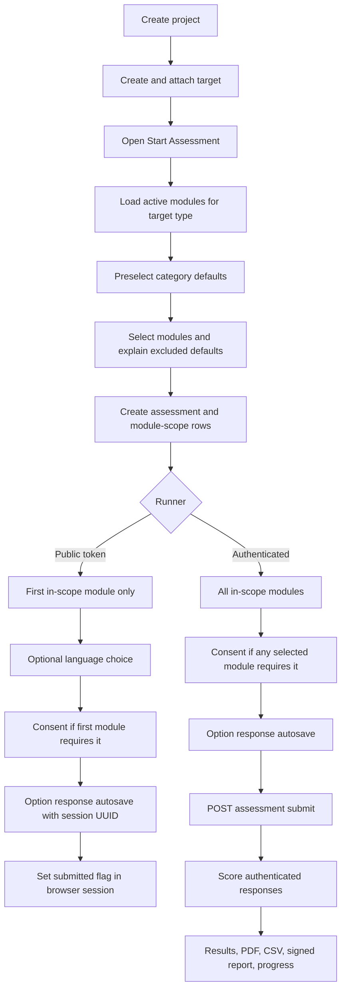

# Current Assessment Flow

## Scope

This document describes the current working tree, including the pre-existing uncommitted multi-module changes. It distinguishes authenticated and public response paths and records where the implementation does not satisfy the documented lifecycle.

## End-to-end flow

## 1. Project and target creation

1. Authenticated user opens `/projects/create`.
2. User supplies project name and one target's type, category, country, region, and optional sub-region.
3. `ProjectController::store()` checks the workspace plan's active-project limit.
4. A transaction creates:
   - a workspace-scoped `projects` row;
   - a workspace-owned `targets` row;
   - a `project_targets` attachment row.
5. The current UI creates one target, but the schema permits multiple targets.

## 2. Assessment creation

1. User opens `/projects/{project}/assessments/create`.
2. Workspace isolation is inherited from `Project` route binding and its global scope.
3. The controller takes the first attached project target.
4. It loads:
   - category defaults from `target_category_default_modules`;
   - active catalogue modules matching the target type.
5. Current uncommitted UI preselects defaults and progressively reveals optional modules and exclusion reasons.
6. On submit, the controller validates that at least one module ID exists globally, checks plan gates, and requires reasons for deselected defaults.
7. It derives `scope_type`:
   - `FULL_TARGET` when selected module IDs exactly equal defaults;
   - `MODULE_PICKER` otherwise.
8. A transaction creates an `assessments` row and one `assessment_module_scope` row per selected or excluded default module.

### Creation risks

- Module IDs are validated for existence but not for compatibility with the target type or category. A crafted request can attach an unrelated platform module.
- Assessment creation has no template/version identifier and no content snapshot.
- The tier is hard-coded by looking up `TIER_1`.
- The schema and UI have no comprehensive-vs-focused product mode; `FULL_TARGET` and `MODULE_PICKER` are implementation scope labels, not governed template workflows.
- Default-module composition is mutable platform data. Editing defaults later changes new assessments but provides no provenance for old ones.

## 3. Authenticated runner

1. `/assessments/{assessment}/run` performs a controller-level project/workspace check.
2. The page mounts `AssessmentRunner` with a public `Assessment` property.
3. The component loads all `assessment_module_scope` rows where `in_scope = true`.
4. It loads active questions for those modules, sorts by module, module-local domain, and display order, and overlays translations for the active locale.
5. Existing authenticated responses are rows with `respondent_id IS NULL`.
6. If any in-scope module requires consent, the component chooses the first such module and checks for any assessment/user consent record.
7. Selecting an option calls `Response::updateOrCreate()` and immediately advances to the next question.
8. UI submission is shown only when every scored question has a saved option response.

### Authenticated-runner risks

- The Livewire assessment property is not `#[Locked]`, contrary to UI rules.
- Livewire actions do not independently re-check workspace membership.
- `selectOption()` does not verify that the question belongs to the assessment scope or that the option belongs to the supplied question.
- Only option responses can be entered. Numeric, open-text, ranking, and multi-select types have no working control/storage path in the runner.
- A scored question without options makes `canSubmit()` permanently false in the UI.
- Consent is effectively assessment/user-level even when multiple modules require separate consent.

## 4. Public respondent runner

1. An authenticated workspace user creates a random 32-character token for an in-progress assessment.
2. `/respond/{token}` mounts `PublicRespondentRunner` without authentication.
3. The component validates token existence/expiry and checks that the assessment is still in progress.
4. It chooses only the first in-scope module.
5. It creates a session-persisted UUID for the respondent.
6. French is offered only when at least one question translation exists for that module.
7. Consent, when required, is stored against the assessment, module, and respondent session UUID.
8. Responses are saved with that session UUID in `responses.respondent_id`.
9. Submit sets only a browser-session `submitted` flag and shows a thank-you state.

### Public-runner risks

- Multi-module assessments are reduced to their first in-scope module without an explicit module choice or token-module binding.
- Public responses are not included by the scoring service.
- Submission is not persisted as a durable respondent-session state.
- Token rows have no creator, revocation flag, use counter, or last-used audit fields.
- Public-runner copy and language controls do not use the same localization infrastructure as the authenticated runner.
- The dropped respondent foreign key allows arbitrary UUID values and removes referential integrity by design.

## 5. Submission and lifecycle

1. Authenticated UI posts `/assessments/{assessment}/submit`.
2. Controller checks workspace ownership through the assessment's project.
3. It sets assessment status to `COMPLETE` and `completed_at` to the current time.
4. All in-scope module rows become `COMPLETED`.
5. Scoring runs synchronously.
6. OWNER and ADMIN users receive a database notification, and optionally email.

### Lifecycle risks

- Server-side submit does not enforce response completeness. A direct POST can complete an unanswered assessment; an existing test explicitly exercises this behavior.
- Completed records are mutable through shared question/module edits because no snapshot exists.
- `publish_status` is independent from completion and is not updated by normal submission.
- Documented status `COMPLETED` differs from actual `COMPLETE`.
- No reopen, archive, or correction workflow is implemented for assessments despite documented status values.

## 6. Scoring flow

1. Read all in-scope module IDs.
2. Read authenticated option responses only.
3. Load sub-indices for selected modules and linked questions.
4. For each sub-index:
   - ignore unscored questions;
   - include only answered options with non-null score values;
   - calculate weighted mean using `sub_index_questions.weight`;
   - persist `NOT_CALIBRATED`, `PARTIAL`, or `CALIBRATED`.
5. Average non-null sub-index scores into global-domain scores.
6. Average all non-null sub-index scores into the overall assessment score.
7. Map the overall score to a maturity level.

### Scoring risks

- PHSAI and school yes/no seed options use `1.0/0.0`; HIVAW uses `100/0`. The service does not normalize these scales.
- Most health-facility questions have no sub-index linkage in the current seed path; local data has 601 questions but only four sub-indices, all created by HIVAW.
- Domain weights are present but unused.
- Multi-module scores are an unweighted blend of all sub-indices, which may not preserve framework semantics.
- Public responses, multi-select responses, numeric bands, observation records, corroboration gaps, topic scores, and project rollups are unused.

## 7. Results and reports

- Results page loads assessment metadata, first-class scores, calculated domain/sub-index breakdowns, maturity, and generated findings text.
- Score history currently groups by project plus `scope_type`; exact module composition is not compared.
- Progress compares any two completed runs within a project.
- PDF and signed public reports use separate Blade views built from the same score queries.
- CSV exports one row per completed assessment but names only the first module.
- Shared report links are stateless Laravel temporary signed URLs; `assessment_share_links` is unused.
- No persisted report version, report snapshot, or report content hash exists.

## Compatibility seam for future templates

The safest future seam is immediately before assessment creation: a template version should resolve to a validated, immutable composition and then populate the existing assessment/module scope and runner inputs through an adapter. The assessment runtime should not query mutable template content after creation. The exact snapshot strategy remains pending Isaac's approval and is not implemented in Phase 21.
