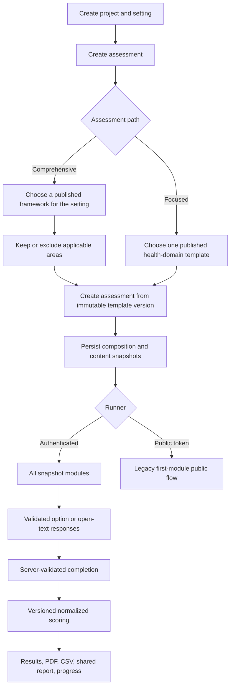

# Current Assessment Flow

## Scope

This document describes the implemented flow after the approved template, snapshot, scoring, and two-path creation modules. It distinguishes the current authenticated and public response paths and records the remaining gaps that are not yet resolved.

## End-to-end flow

## 1. Project and setting creation

1. An authenticated user opens `/projects/create`.
2. The user supplies a project name and one setting's type, category, country, region, and optional sub-region.
3. The selected category must belong to the selected setting type.
4. A `CUSTOM` setting can carry a user-defined label and a `uses_departments` flag.
5. The plan's active-project limit is checked.
6. A transaction creates a workspace-scoped project, its workspace-owned target/setting, and the project-target attachment.

The UI creates one setting initially, while the underlying schema still permits multiple targets per project.

## 2. Assessment creation

There are exactly two user-facing creation paths.

### Comprehensive Health Assessment

1. The controller loads published `COMPREHENSIVE` template versions compatible with the project's setting type.
2. The user selects one framework.
3. The framework's default areas are preselected. The user can remove areas that do not apply.
4. Department language is used only when the selected setting explicitly uses departments; otherwise the UI uses neutral area/module language.
5. The submitted template version and exclusions are revalidated on the server.

### Focused Health Assessment

1. The controller loads published `FOCUSED` template versions.
2. The user chooses one health programme, topic, or intervention template.
3. No department, standard-battery, grouped-module, or unrelated-topic picker is shown.
4. The selected focused template must resolve to exactly one module.

### Shared creation service

Both paths delegate to `AssessmentCreationService`. It verifies the published immutable template version, setting compatibility, composition rules, and plan limits; creates the assessment and scope rows; and stores immutable composition/content snapshots with provenance and hashes. Runtime content for template-created assessments is loaded from the snapshot rather than mutable catalogue questions.

Publishing stores both the SHA-256 hash and the exact hashed payload. New assessments are created from that stored payload, never by rebuilding a published version from the mutable catalogue.

The old default-battery/module-picker creation path is no longer used. The former PHSAI and school sample seeders are not part of normal database seeding. The repository's valid HIV focused content is seeded and published as a selectable template.

## 3. Authenticated runner

1. `/assessments/{assessment}/run` verifies project/workspace access.
2. The Livewire component locks the assessment identifier and independently rechecks authorization during actions.
3. For template-created assessments, questions, translations, options, and ordering come from the immutable assessment content snapshot.
4. The runner covers every in-scope module.
5. Option submissions are accepted only when the question is in scope and the option belongs to that question.
6. Open-text questions use the supported text-response path; unsupported response types cannot be published in templates.
7. Responses autosave. Authenticated responses have `respondent_id IS NULL`.
8. Submission is rejected on the server until all required scored questions are complete.
9. An assessor may progressively reveal an optional supporting-evidence note. The note is stored on that exact response, does not count as an answer, and does not create another workflow.

Remaining authenticated-runner work is limited to future response types and more granular consent policy. It is no longer a reason to retain invalid sample content.

## 4. Public respondent runner

1. A workspace user creates a token for an in-progress assessment; the token records its creator and supports expiry and revocation.
2. `/respond/{token}` validates the token and assessment state, then creates or resumes a durable `public_response_sessions` row.
3. Token usage count and last-use time are updated when a new respondent session begins.
4. All in-scope modules are loaded. Template-created assessments use the same immutable content snapshot as the authenticated runner.
5. Language selection is stored on the durable session. Consent is stored for every in-scope module that requires it.
6. Responses reference the durable session through a foreign key. Staff rows are explicitly distinguished by a null public-session foreign key.
7. Question, option, and text mutations are revalidated against authoritative in-scope content.
8. Submit rechecks all required stored responses, freezes an immutable response snapshot, independently scores it with the assessment's frozen profile, and persists the submitted state and immutable respondent score.
9. If the template defines eligibility rules, the session remains excluded as `PENDING` until an OWNER or ADMIN reviews it. A template with no eligibility rules may classify a valid submitted session as eligible automatically.
10. The collection review shows eligible count, minimum threshold, provisional arithmetic mean, scoring/template versions, and exclusion reasons.
11. Reaching the threshold never auto-finalizes. An OWNER or ADMIN manually finalizes the exact session set.
12. Finalization persists reproducibility hashes and trace references, completes the ordinary assessment lifecycle, and creates the ordinary immutable report. The public runner rejects late submissions after completion.

External respondents are a respondent role within the same assessment architecture. Community surveys, patient-experience surveys, citizen feedback, caregiver feedback, and similar uses are normal assessment templates using the standard lifecycle, scoring, reporting, permissions, exports, dashboards, and analytics. Arithmetic mean is the only initial multi-respondent method, not a permanent universal formula.

## 5. Submission and lifecycle

1. Authenticated submission verifies workspace ownership and required-response completeness. It cannot complete a multi-respondent assessment.
2. The assessment becomes `COMPLETE`, receives `completed_at`, and all in-scope module rows become `COMPLETED`.
3. Scoring runs synchronously and stores the scoring algorithm/version used.
4. The same transaction persists an immutable structured report snapshot with schema version and SHA-256 content hash.
5. OWNER and ADMIN users receive a database notification and optional email.

The assessment content and composition are immutable through snapshots. `IN_PROGRESS -> COMPLETE` is the only assessment transition and completion is terminal. Area rows use `PENDING`, `COMPLETED`, or `EXCLUDED`; template versions use `DRAFT -> PUBLISHED` and become immutable. Reopen, correction-version, retirement, and archive behavior remain intentionally unavailable until their snapshot and audit semantics are approved.

## 6. Scoring flow

1. Read all in-scope module IDs and the authoritative response set for one scoring unit. Staff and public-session rows are explicitly separated.
2. For template-created assessments, read sub-index membership, question weights, option weights, and domain identity from the assessment snapshot. Legacy assessments use the live profile compatibility path.
3. Normalize option score scales to a canonical 0–100 range.
4. Calculate weighted sub-index results with explicit calibration states.
5. Aggregate domain and overall results and map the overall result to a maturity level.
6. Persist the scoring version with calculated scores so future algorithm changes remain distinguishable.

### Remaining scoring risks

- Domain weights and cross-module aggregation policy require an explicit governed formula.
- Future aggregation methods require explicit versioned methodology and must continue to use the shared scoring/reporting architecture.
- Numeric, multi-select, ranking, observation, and corroboration models are postponed until their product need and scoring semantics are approved.

## 7. Results and reports

- Newly completed results, PDF, shared reports, and history read the immutable final report snapshot rather than mutable catalogue labels or score joins.
- The structured report snapshot preserves assessment identity, all included areas, setting/project labels, score and maturity, scoring version, domain/sub-index labels and values, completion time, schema version, and content hash.
- Historical comparisons require matching composition hashes. Legacy assessments without hashes fall back to exact sorted module-ID fingerprints.
- CSV lists every included module rather than only the first.
- New shared-report links are persistent records with creator, expiry, revocation, use count, and last-used time. Legacy temporary signed URLs remain readable for backward compatibility.
- The Reports index lists completed assessments in the active workspace and provides the existing view, PDF, create-link, and revoke-link actions.
- Template publication, assessment creation/completion, report finalization, and public/report link lifecycle events write immutable audit records.

## Current implementation boundary

Template versions and assessment snapshots are now the creation/runtime boundary. Legacy sample data is not a compatibility contract. New work should strengthen this boundary, migrate or reseed valid content into it, and remove obsolete paths rather than weakening template validation to accommodate samples.
