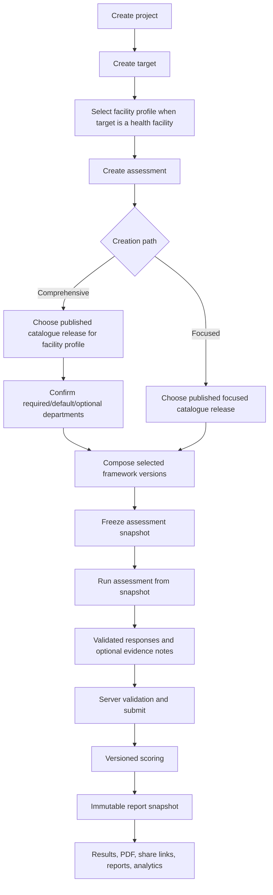

# Current Assessment Flow

## Scope

This document describes the implemented catalogue-composition assessment flow. The repository code is the technical source of truth.

## End-to-End Flow

## 1. Project and Setting Creation

1. The user creates one project.
2. The user selects a setting type and enters the setting name.
3. If the setting is a health facility, the user selects a Vytte facility profile such as Clinic, Primary Health Centre, or General Hospital.
4. A transaction creates the workspace-scoped project, target, and project-target attachment.

The project model currently supports one assessed setting per project.

## 2. Comprehensive Health Assessment

Comprehensive Health Assessment is a composition orchestrator.

1. The target's facility profile is resolved.
2. The controller loads published comprehensive catalogue releases for that profile.
3. The UI shows services included in the assessment.
4. Required departments are locked in.
5. Default departments are preselected and may be removed with a reason when allowed.
6. Optional departments may be selected by the user.
7. The submitted department selection is revalidated on the server.
8. The assessment is created from exact department framework versions pinned by the catalogue release.

The orchestrator owns no clinical questions.

## 3. Focused Health Assessment

1. The controller loads published focused catalogue releases.
2. The user selects one health domain, programme, topic, or intervention.
3. The selected release resolves to one official framework scope in the current implementation.
4. No unrelated department checklist or bulk starter set is shown.

## 4. Snapshot Creation

`AssessmentCreationService::createFromCatalogue` creates the assessment.

It freezes:

- catalogue release ID, code, and hash;
- facility profile ID and code when applicable;
- exact selected department framework version IDs;
- framework version numbers and content hashes;
- excluded departments and exclusion reasons;
- full rendered question/options/numeric/scoring payload;
- aggregation policy;
- scoring profile version;
- collection configuration.

This snapshot is the runtime authority. Later edits to master content or future framework versions cannot change an existing assessment.

## 5. Runner

The authenticated runner:

1. Verifies workspace authorization.
2. Loads questions from `assessment_snapshots.payload`.
3. Supports option, open-text, and numeric inputs.
4. Stores optional supporting evidence on the exact response as `responses.evidence_note`.
5. Autosaves responses.
6. Rejects writes when the question or option is not in the frozen snapshot.

Evidence is context support. It is not a separate workflow.

## 6. Public Respondent Collection

Multi-respondent collection remains part of the same assessment architecture.

Published content must explicitly enable it and freeze:

- minimum completed eligible respondent threshold;
- aggregation method;
- eligibility rules;
- scoring profile version.

Each submitted public session is scored independently and keeps immutable response and score snapshots. Eligible completed sessions can be manually finalized by an authorized workspace user. Finalization creates the ordinary immutable Vytte report.

There is no separate community or respondent report.

## 7. Completion

Authenticated completion:

1. Rechecks workspace authority.
2. Rejects completion until required scored questions are answered.
3. Marks the assessment `COMPLETE`.
4. Marks included module-scope rows `COMPLETED`.
5. Calculates versioned scores.
6. Creates one immutable final report snapshot.
7. Notifies workspace owners/admins.

Completion is terminal.

## 8. Scoring

Scoring:

1. Reads included module IDs.
2. Reads only official snapshot scoring profile data.
3. Reads the selected response set.
4. Calculates sub-index, domain, and overall scores.
5. Applies the frozen aggregation policy.
6. Persists algorithm version and calibration status.

Local custom sections are intentionally absent from this flow.

## 9. Reporting

Reports, exports, shared links, dashboards, and analytics use the ordinary Vytte report architecture.

The final report snapshot preserves:

- assessment and target identity;
- catalogue release and composition hash;
- included departments;
- score and maturity data;
- scoring version;
- domain/sub-index results;
- completion and report timestamps;
- reproducibility hash.

## Current Boundary

The default governed dataset is demonstration content. It proves the architecture, not production clinical methodology.
