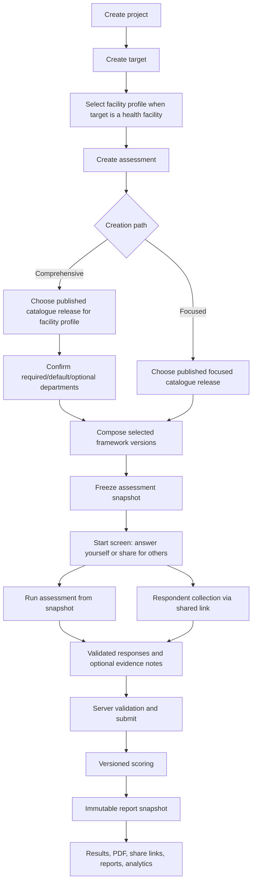

# Current Assessment Flow

## Governed Authoring Flow

The Platform Admin sidebar exposes the Assessment Builder as **Governance Studio**. It uses nine distinct, clickable steps: Purpose, Publisher & source, Structure, Questions, Logic, Scoring, Review, Test, and Publish. Structure captures respondent-facing section instructions, estimated time, intended respondent, and repeatable intent. Questions separates original writing and governed-library reuse from section design. Logic accepts only frozen, earlier-question conditions, preventing circular or forward references. Scoring declares the measured construct, direction, missing-response policy, and every contributing item rule. Review keeps deterministic checks, AI advice, and independent trust claims visible before Test. Test is an interactive no-save simulation powered by the same evaluator used during live collection, completeness checks, and scoring. Publish is a separate final readiness and immutable-confirmation screen and remains a human action.

## Scope

This document describes the implemented catalogue-composition assessment flow. The repository code is the technical source of truth.

## End-to-End Flow

```mermaid
flowchart TD
    P[Create project] --> T[Create target]
    T --> FP[Select facility profile when target is a health facility]
    FP --> C[Create assessment]
    C --> PATH{Creation path}

    PATH -->|Comprehensive| CR[Choose published catalogue release for facility profile]
    CR --> DEP[Confirm required/default/optional departments]
    DEP --> COMP[Compose selected framework versions]

    PATH -->|Focused| FR[Choose published focused catalogue release]
    FR --> COMP

    COMP --> SN[Freeze assessment snapshot]
    SN --> START[Start screen: answer yourself or share for others]
    START --> RUN[Run assessment from snapshot]
    START --> COLLECT[Respondent collection via shared link]
    RUN --> RESP[Validated responses and optional evidence notes]
    COLLECT --> RESP
    RESP --> SUB[Server validation and submit]
    SUB --> SCORE[Versioned scoring]
    SCORE --> REP[Immutable report snapshot]
    REP --> OUT[Results, PDF, share links, reports, analytics]
```

## 1. Project and Setting Creation

1. The user creates one project.
2. The user selects a setting type and enters the setting name.
3. If the setting is a health facility, the user selects a Vytte facility profile such as Clinic, Primary Health Centre, or General Hospital.
4. A transaction creates the workspace-scoped project, target, and project-target attachment.

The project model currently supports one assessed setting per project.

## 2. Comprehensive Health Assessment

Comprehensive Health Assessment is a composition orchestrator.

1. The target's facility profile is resolved.
2. The controller loads every published comprehensive catalogue release for that profile, without
   filtering by workspace plan or catalogue entitlement during beta.
3. The UI shows services included in the assessment.
4. Required departments are locked in.
5. Default departments are preselected and may be removed with a reason when allowed.
6. Optional departments may be selected by the user.
7. The submitted department selection is revalidated on the server.
8. The assessment is created from exact department framework versions pinned by the catalogue release.

The orchestrator owns no clinical questions.

## 3. Focused Health Assessment

1. The controller loads every published focused catalogue release for every workspace and setting,
   without filtering by workspace plan or catalogue entitlement during beta.
2. The user selects one health domain, programme, topic, or intervention.
3. The selected release resolves to one official framework scope in the current implementation.
4. No unrelated department checklist or bulk starter set is shown.

## 4. Snapshot Creation

`AssessmentCreationService::createFromCatalogue` creates the assessment.

It freezes:

- catalogue release ID, code, and hash;
- facility profile ID and code when applicable;
- exact selected department framework version IDs;
- framework version numbers and content hashes;
- excluded departments and exclusion reasons;
- full rendered question/options/numeric/scoring payload;
- aggregation policy;
- scoring profile version;
- collection configuration.

This snapshot is the runtime authority. Later edits to master content or future framework versions cannot change an existing assessment.

## 5. Runner

The authenticated runner:

1. Verifies workspace authorization.
2. Loads questions from `assessment_snapshots.payload`.
3. Supports single-select, multi-select, Likert/rating, explicitly unscored open text, and numeric inputs.
4. Preserves explicit response states such as not applicable, unknown, not assessed, not observed, and declined.
5. Applies frozen, earlier-answer branching consistently across rendering, completeness, and scoring.
6. Stores optional supporting evidence on the exact response as `responses.evidence_note`.
7. Autosaves responses.
8. Rejects writes when the question or option is not in the frozen snapshot.

Evidence is context support. It is not a separate workflow.

## 6. Public Respondent Collection

Multi-respondent collection remains part of the same assessment architecture.

For workspace users, opening collection and creating the first respondent link is one deliberate,
idempotent action. The action publishes and locks the assessment, creates the first active link when
none exists, and redirects to the collection page with that link visible and ready to copy. Retrying
the action reuses the active link rather than creating duplicates. One reusable active link is the
normal contract and may collect responses from many people. After deactivation, an operator may
create one replacement link. The operator workflow is **Open and share → Collect → Review →
Finalise**; collection may be closed and reopened while the assessment remains incomplete.
The **Collect & review responses** page is the only assessment-specific operations surface: it
contains link management, live response progress, completed-response review, eligibility decisions,
the provisional aggregate, and finalisation. The workspace-wide Monitor page still summarizes
multiple assessments. The former per-assessment `/monitor` URL redirects to collection so saved
bookmarks do not break.

Published content must explicitly enable it and freeze:

- minimum completed eligible respondent threshold;
- aggregation method;
- eligibility rules;
- scoring profile version.

Each submitted public session is scored independently and keeps immutable response and score snapshots. Eligible completed sessions can be manually finalized by an authorized workspace user. Finalization creates the ordinary immutable Vytte report.

Deactivating or expiring a link prevents future access through that link. It does not invalidate a
session that was already submitted: completed-session eligibility remains an explicit review
decision. All respondent-facing definitions, including local questions, are locked when collection
opens so every respondent receives the same instrument.

There is no separate community or respondent report.

## 7. Completion

Authenticated completion:

1. Rechecks workspace authority.
2. Rejects completion until required scored questions are answered.
3. Marks the assessment `COMPLETE`.
4. Marks included module-scope rows `COMPLETED`.
5. Calculates versioned scores.
6. Creates one immutable final report snapshot.
7. Notifies workspace owners/admins.

Completion is terminal.

## 8. Scoring

Scoring:

1. Reads included module IDs.
2. Reads only official snapshot scoring profile data.
3. Reads the selected response set.
4. Calculates sub-index, domain, and overall scores.
5. Applies the frozen aggregation policy.
6. Persists algorithm version and calibration status.

Local custom sections are intentionally absent from this flow. Where a workspace added one, it is
scored separately by `CustomSectionScoringService` as an optional local score after this flow
completes, and that local score never feeds back into the published overall score above.

## 9. Reporting

Reports, exports, shared links, dashboards, and analytics use the ordinary Vytte report architecture.

The final report snapshot preserves:

- assessment and target identity;
- catalogue release and composition hash;
- included departments;
- score and maturity data;
- scoring version;
- domain/sub-index results;
- completion and report timestamps;
- reproducibility hash.

It may also freeze primary, common-core, context/needs, qualitative, critical, coverage, limitation,
issue-tracking, action, and comparison views. Presentation lenses never rewrite these facts.

## Current Boundary

The default production seed is the governed official beta library described in
`OFFICIAL_SEED_REPORT.md`. It is source-informed and product-owner approved, but it is not a claim of
universal clinical authority. Jurisdiction-specific regulation and independent clinical review must
produce governed successor versions where stronger evidence or local adaptation is required.
