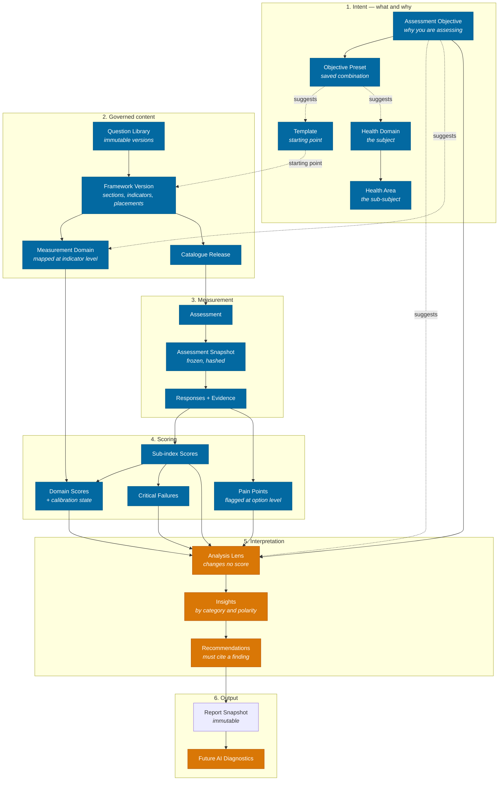

# Diagnostics and Intelligence Pipeline

The end-to-end reasoning path from intent to insight. Every future reporting, diagnostics and AI module follows this one architecture.

Design document. Stages 1–8 are implemented today; stages 9–12 are designed and not built.

## The pipeline

Blue is implemented. Amber is designed and not built.

## Stage by stage

| # | Stage | What happens | Authority | State |
| --- | --- | --- | --- | --- |
| 1 | Objective | The user says *why*. Purpose only. | `assessment_objectives` | Built |
| 2 | Health domain and area | The user says *what subject*. | `health_domains`, `health_areas` | Built |
| 3 | Template / preset | Suggests a starting point. Never constrains. | `assessment_templates`, `objective_presets` | Built |
| 4 | Question library | Immutable question versions selected into a framework. | `question_versions` | Built |
| 5 | Framework and measurement domain | Placements bind exact question versions; indicators map to measurement domains. | `framework_question_placements`, `framework_indicator_domain_mappings` | Built |
| 6 | Assessment and snapshot | Composition frozen and hashed. Reproducibility begins here. | `assessment_snapshots` | Built |
| 7 | Responses and evidence | Answers validated against the frozen snapshot. | `responses` | Built (evidence is text-only) |
| 8 | Scores, pain points, critical failures | Sub-index and domain scores with calibration state; pain points flagged at option level. | `ScoringService`, `domain_scores` | Built |
| 9 | Analysis lens | Selects and orders what was measured. **Changes no score.** | `analysis_lenses` | Taxonomy built, engine not |
| 10 | Insights | Findings classified by category and polarity. | `insight_categories` | Taxonomy built, engine not |
| 11 | Recommendations | Must cite the finding they came from. | — | Designed only |
| 12 | Report and AI | Immutable report snapshot; AI consumes the same structures. | `assessment_report_snapshots` | Report built, AI not |

## The two invariants

Everything downstream depends on these holding.

**A lens never changes a score.** It selects, orders and frames what stage 8 already produced. This is what makes multiple valid readings possible without duplicated scoring logic, and it is why a Risk report and a Performance report from the same assessment are both correct.

**A recommendation must name the finding it came from.** A recommendation that cannot point at a specific score, response, pain point or trend is generic advice wearing the authority of an assessment. This constraint binds any future generator, rule-based or AI.

## Where AI attaches

Future AI consumes stages 8–10 and produces stage 11. It does not reach back into stages 1–7.

This matters: scoring stays deterministic and reproducible, the snapshot stays the authority on what was asked, and an AI-generated recommendation is auditable against the same frozen data a human would read. If AI were allowed to influence scoring, no report could be reproduced.

---

# Architecture Stress Test

Ten scenarios run against the model without modification.

| # | Scenario | Objective | Subject | Template | Verdict |
| --- | --- | --- | --- | --- | --- |
| 1 | Hospital-wide accreditation | `ACCREDITATION` | General Health Systems | `ACCREDITATION_READINESS` (enterprise) | **Passes** |
| 2 | HIV programme | `PROGRAMME_EVALUATION` | HIV + 5 areas | `HIV_PROGRAMME` (focused) | **Passes** |
| 3 | Malaria | `BASELINE` | — | `MALARIA_PROGRAMME` | **Strains** — see D1 |
| 4 | WASH / sanitation | `SITUATION_ANALYSIS` | WASH + 5 areas | `WASH_ASSESSMENT` | **Passes** |
| 5 | Community nutrition survey | `BASELINE` | Nutrition + 3 areas | `COMMUNITY_OUTREACH` | **Passes** — `COMMUNITY` target type exists |
| 6 | Mental health QI | `QUALITY_IMPROVEMENT` | Mental Health + 4 areas | `MENTAL_HEALTH_SERVICES` | **Passes** |
| 7 | Research baseline | `BASELINE` | any | `RESEARCH_INSTRUMENT` | **Passes** |
| 8 | Research endline | `ENDLINE` | any | `RESEARCH_INSTRUMENT` | **Strains** — see D2 |
| 9 | Primary healthcare | `OPERATIONAL_READINESS` | General Health Systems | `PHC_ASSESSMENT` (enterprise) | **Passes** |
| 10 | Supportive supervision | `SUPPORTIVE_SUPERVISION` | any | `SUPPORTIVE_SUPERVISION_VISIT` | **Strains** — see D3 |

## Confirmed: one engine, no duplication

Enterprise and focused assessments differ only in `scope_type`, which is presentational. Both compose through the same builder, freeze into the same snapshot structure, score through the same `ScoringService`, and roll up into the same measurement domains. Scenario 1 (whole hospital, ~240 min) and scenario 3 (single programme, ~75 min) traverse identical code.

The existing `creation_path` distinction (`COMPREHENSIVE` / `FOCUSED`) already proved this at the catalogue-release layer before P4; templates inherit the same property rather than introducing a second mechanism.

## Defects found

### D1 — Malaria, NCDs and NTDs are not health domains

Malaria is a *health area* under `GENERAL_HEALTH_SYSTEMS`. The seeded `MALARIA_BASELINE` preset therefore points its health domains at `GENERAL_HEALTH_SYSTEMS`, which is imprecise and would mis-file every malaria assessment in the platform.

For a product whose primary market is Nigeria, Ghana, Kenya and South Africa, malaria not being a first-class subject is a methodology error, not a gap.

The same applies to non-communicable diseases and neglected tropical diseases.

**Fix before the master seed.** After it, content will already be mapped to the wrong domain and re-mapping means a methodology version plus content migration.

### D2 — No link between a baseline and its endline

`BASELINE` and `ENDLINE` objectives exist, and the Trend lens compares assessments of the same target. But nothing records that assessment B is the endline *for* baseline A. Trend infers a sequence by date, which is right for routine monitoring and wrong for a study with a defined start and end.

Low severity while assessments per target are few. It becomes wrong quietly rather than loudly, which is the kind of defect worth recording now.

### D3 — No agreed-actions entity for the Progress lens

The Progress Tracking lens reads results "against previously agreed actions". No such entity exists. Supportive supervision — the scenario that most needs it — currently has nothing to track progress against, so the lens would silently fall back to comparing scores, which is a different question.

Either build an actions entity when lens-driven reporting is built, or narrow the lens definition to score-progress and rename it honestly.

---

# Knowledge Model Review

Reviewed against WHO SARA, SPA, HHFA, the health system building blocks, and common programme-review practice.

## Recommended before the master seed

### Health domains — promote six subjects

Currently absorbed as areas under `GENERAL_HEALTH_SYSTEMS`, which now carries 14 areas — a sign it is doing too much.

| Promote | Why |
| --- | --- |
| **Malaria** | Highest disease burden in the primary market. Currently mis-filed. |
| **Non-Communicable Diseases** | Fastest-growing burden; routinely assessed separately. |
| **Laboratory** | Lab assessments are a standalone international exercise. |
| **Pharmacy and Supply Chain** | Commodity assessments are standalone and very common. |
| **Emergency and Critical Care** | WHO emergency care systems agenda. |
| **Neglected Tropical Diseases** | Named in the brief; currently absent entirely. |

### Objectives — three missing, one significant

| Add | Why |
| --- | --- |
| **Data Quality Assessment** | WHO, Global Fund and PEPFAR run DQAs routinely. This is the most commonly performed assessment type currently absent. Distinct from Health Information Systems, which asks whether systems exist rather than whether the data is true. |
| **Training and Capacity Needs Assessment** | Very common precursor to any capacity-building programme. |
| **Results-Based Financing Verification** | Widely used across the primary market; the verification visit is a recognised assessment type. |

### Measurement domains — one genuine gap

The seven are: Governance, Workforce, Service Delivery, Safety and Quality, Infrastructure/Equipment/Supplies, Information, Person-Centredness.

**Health Financing is a WHO building block with no measurement domain.** `HEALTH_FINANCING` exists as an objective but there is no dimension for financing findings to roll up into, so a financing weakness cannot be compared across programmes the way a workforce weakness can.

This is a taxonomy version change and touches `domain_scores`. Cheaper before the master seed than after, but it is a genuine architectural change rather than catalogue content — flagging rather than assuming.

### Insight categories — one important omission

**Data Gaps / Insufficient Evidence.** The platform already computes calibration states (`NOT_CALIBRATED`, `PARTIAL`) and nothing surfaces them as a finding. An assessment that is 40% unanswered currently produces a confident-looking report from thin data.

This is the single most valuable addition on this list. Every other category describes what the data says; this one describes when the data cannot support a conclusion — which protects the credibility of everything else.

### Analysis lenses — two candidates

- **Efficiency / Value for Money** — a distinct question from performance, and central to financing and donor conversations.
- **Sustainability** — whether a programme could continue without current external support. Standard in programme evaluation.

### Recommendation categories — extend from eight

Add **Supply Chain and Commodities**, **Community Engagement**, **Financing and Budget**, **Data and Information Systems**, **Referral and Coordination**. Current set skews toward clinical and management action.

### Templates — follow the domains

If the six health domains are promoted, add matching focused templates: Data Quality Assessment, NCD Services, Surgical Care, Blood Services. `RBF_VERIFICATION` if that objective is added.

---

# Recommendation Framework Validation

## Can it produce different valid sets from one assessment?

Yes, and the mechanism is structural rather than conventional.

The lens is an **input** to generation, not a filter applied afterwards. Worked example on one completed hospital assessment:

| Lens | Leads with | Because |
| --- | --- | --- |
| Risk | Oxygen supply critical failure | A critical failure outranks any average |
| Quality Improvement | Documentation weakness across 3 areas | Systemic and improvable within a cycle |
| Compliance | Two unmet mandatory standards | Partial credit is irrelevant to a binary requirement |
| Executive | One sentence on overall readiness plus the single largest risk | The reader will not read the detail |

None of these recalculates a score. All four are correct answers to different questions.

## Never score-threshold alone

Confirmed by design. `RECOMMENDATION_FRAMEWORK.md` records eleven inputs, and the governing constraint is that a recommendation must cite a specific finding — which may be a **response**, a **pain point** or a **trend**, none of which is a score.

The retired `recommendation_rules` table could only express score thresholds. That is precisely why it was retired rather than extended.

## Improvements recommended

1. **Add Data Gaps as an insight category** (above). Without it, a recommendation can be generated from data too thin to support it, with nothing marking that.
2. **Record lens preconditions in the taxonomy.** Trend needs two completed assessments; Benchmarking needs a peer set. Today that is prose in a description. It should be structured so a lens with unmet preconditions says so rather than rendering empty.
3. **Decide where generated recommendations are stored** before generation is built. The reproducibility contract implies they must be frozen into the report snapshot — otherwise re-running generation later would silently change a report already sent to a customer. Recorded as open in the framework doc.

---

# Phase Boundary Review

Reviewed for drift into reporting, diagnostics, analytics, AI or prediction.

| Built | Classification | Verdict |
| --- | --- | --- |
| `analysis_lenses` | Taxonomy of interpretive perspectives | Foundation. No engine reads it. |
| `insight_categories` | Taxonomy of finding shapes | Foundation. No engine produces them. |
| `objective_recommendations` | Static curated suggestions about content | Foundation. Not generated recommendations. |
| `MethodologyPublishingService` | Governance and reproducibility | Foundation, consistent with existing publishers. |
| `RECOMMENDATION_FRAMEWORK.md` | Design record | Documentation. |

**No drift found.** Nothing computes a score, produces an insight, generates a recommendation, or predicts anything. The phase delivered vocabulary and governance, which is what it was scoped to deliver.

One judgement worth surfacing: `insight_categories.is_diagnostic` could look like diagnostics leaking in. It is a classification attribute — it records that a category points at a cause rather than a symptom. Nothing consumes it yet.

---

# Future-Proofing

## Would this survive Vytte becoming a leading health assessment, diagnostics and intelligence platform?

**Yes, without major redesign** — because the model separates three axes that most assessment platforms conflate:

- **What** is being assessed — health domain and area
- **Which dimension** it is measured on — measurement domain
- **How** it is read — analysis lens

Most platforms collapse these into one taxonomy, then cannot answer cross-cutting questions. Vytte can ask *"is governance the common weakness across our HIV, TB and malaria programmes?"* — which is an intelligence question, not a reporting one, and it is answerable because the three axes are orthogonal.

Reproducibility is the other structural strength. Every layer freezes and hashes. An AI recommendation made in 2027 against a 2026 report can be re-derived, which matters enormously the first time a customer disputes a finding.

## What would strain

| Risk | When it bites | Mitigation |
| --- | --- | --- |
| Benchmarking needs cross-tenant comparison | First peer-comparison feature | Row-scoped multi-tenancy makes this a deliberate, auditable exception rather than an accident. Design before building. |
| Evidence is text-only | First image or document evidence requirement | Known debt. Affects AI most, since photographs are strong diagnostic input. |
| Prediction needs longitudinal depth | Not before several cycles of data | Nothing to change now; the snapshot chain already preserves what is needed. |
| Measurement domains are fixed at seven | If financing or equity need separate roll-up | Taxonomy is versioned; this is a methodology version, not a redesign. |

None requires architectural redesign. The first two are known and recorded.

---

# On Keeping the Seven Measurement Domains

**Recommendation: keep them.** Do not fold them into the new layer.

They are the only structure that permits cross-subject comparison. Without them, an assessment covering HIV, TB and malaria can report that HIV scores 60, TB 70, malaria 55 — but cannot report that *workforce capability is the common weakness across all three*. That second statement is the intelligence Vytte exists to sell, and it is produced by rolling scores up along a dimension that is independent of subject.

Analysis lenses cannot replace them. A lens holds no score, by design. Health domains cannot replace them either — those are subjects, and a subject cannot be a comparison axis across subjects.

The three concepts are genuinely orthogonal. One question — *"is there a written IPC policy?"* — is simultaneously:

- **subject:** Infection Prevention and Control (health domain)
- **dimension:** Governance (measurement domain)
- **readable under:** Compliance, Risk, or Clinical Governance (lenses)

Removing any axis loses information that cannot be reconstructed from the other two.

They are also already live: `domain_scores`, `framework_indicator_domain_mappings`, placement-level overrides, calibration states and a published taxonomy version all depend on them. Removing them would be an expensive change that costs capability.

**They are already synced.** P4 required no change to them. The only problem was the word "lens", which the documentation had spent on measurement domains and P4 needed for the intelligence layer. That wording is retired; the domains themselves are untouched.

The one change worth considering is *adding* Health Financing as an eighth, discussed above.
