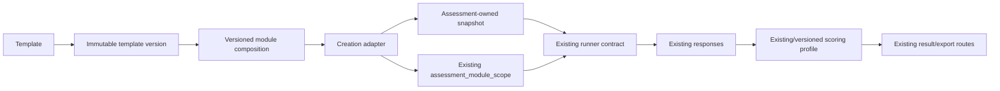

# Phase 21 Recommendation

## Executive recommendation

The proposed Template Architecture is **conditionally compatible** with the existing Laravel monolith. The repository already has reusable platform modules, module-scoped assessments, question assets, translations, runners, responses, scoring outputs, and reporting routes. A template/version layer can sit above these assets and feed the existing assessment runtime.

It is not safe to begin template implementation yet. The current baseline has unresolved tenancy, lifecycle, response-type, scoring-scale, reproducibility, and worktree-status risks. Phase 22 should establish the regression and security baseline first. Template implementation should then be additive and feature-flagged, with legacy assessment creation retained until equivalence is proven.

## 1. Is the proposed Template Architecture compatible?

**Yes, with constraints.** Compatibility is strongest at the `assessment_module_scope` seam:

Compatibility conditions:

- Do not rename or replace `assessment_modules`, `assessment_module_scope`, questions, responses, or score tables.
- Do not make completed assessments depend on mutable template/master records.
- Define response-type and scoring-profile compatibility before a template can publish.
- Preserve legacy assessments with no template reference.
- Keep current URLs and exports available.
- Use a feature flag and an adapter so template-based creation is optional during rollout.

## 2. Smallest safe implementation path

### Phase 22: regression and security baseline only

1. Decide the baseline disposition of the current dirty worktree.
2. Run the full existing suite on the approved baseline and record exact pass/fail/skip counts, duration, PHP/Laravel versions, commit, and database engine.
3. Add PostgreSQL parity execution for migrations and critical tests; retain SQLite only if explicitly approved.
4. Add characterization tests for:
   - assessment creation, module compatibility, and exclusion rows;
   - authenticated and public runner authorization;
   - response uniqueness/concurrency;
   - every currently declared response type;
   - server-side completion rules;
   - exact scoring fixtures, 0/1 versus 0-100 behavior, null calibration, and multi-module aggregation;
   - respondent-role scoring behavior within the shared scoring engine;
   - completed results/PDF/CSV/signed-link reproducibility;
   - mutable question/option effects on completed output;
   - Flutterwave webhook CSRF/signature path.
5. Produce a baseline report; do not correct behavior until Isaac approves each resulting change.

### Phase 23: taxonomy only after approval

- Add controlled health-domain, programme, setting, department/service-area, authority, jurisdiction, and applicability concepts.
- Map them to legacy target types, topics, modules, module domains, and global scoring domains.
- Do not rename legacy tables/columns or change runner behavior.

### Phase 24: minimum template foundation

- Add templates, immutable template versions, and version-to-module composition.
- Add source/authority/license/applicability/language/scoring-readiness metadata.
- Add draft/review/published/retired governance and curator permissions.
- Validate that every published composition uses supported response types and an approved scoring profile.
- Do not replace current assessment creation.

### Phase 25: snapshot before workflow replacement

- Add an assessment-owned immutable snapshot and composition fingerprint.
- Store exact wording, options, order, applicability, response type, evidence rule, module composition, and scoring-profile version needed to reproduce the run.
- Add nullable provenance for new assessments; legacy rows remain valid without it.
- Build an adapter that materializes existing `assessment_module_scope` rows from a template version.
- Prove completed-output reproducibility before enabling templates.

### Phases 26-27: feature-flagged user workflows

- Comprehensive: facility/setting, versioned framework, applicable services, exclusions, preview, snapshot, create.
- Focused: health domain/programme, filtered approved template, preview, permitted customization, snapshot, create.
- Both paths should converge on the same adapter and existing runner.
- Keep legacy creation available until migration/retirement is separately approved.

## 3. Components that should remain untouched

- Authentication and registration transaction.
- Existing workspace, membership, project, and target records.
- Existing primary keys, foreign keys, table/column names, and stored status values.
- Completed assessments, consent, responses, score rows, and public tokens.
- Existing result, PDF, CSV, signed-report, progress, and comparison URLs.
- Billing limits, feature matrix, notification/email gate, and payment-signature logic.
- Tailwind design tokens, layouts, theme persistence, and reusable visual components.
- Existing translation records and English fallback.
- Dormant schema until production use is verified.

## 4. Components that require extension

- Module catalogue: versioned template composition above it.
- Assessment creation: optional template-version input and adapter.
- Assessment records: additive provenance/snapshot relationship.
- Runner: snapshot-backed question source and response-type renderer registry.
- Scoring: explicit scoring-profile/version selection while preserving legacy service output.
- Results/reports: display template/version/provenance and use frozen snapshot content.
- Admin: curator workflow, validation, publish/retire, and audit events.
- Feature configuration: template discovery/creation flags.
- Taxonomy: controlled mappings to legacy structures.

## 5. Components that require refactoring

Refactoring should occur only behind tests and separate approvals:

- Tenant authorization: reduce reliance on ad hoc controller checks and protect Livewire actions.
- Assessment creation controller: move orchestration into a transactional application service that both legacy and template adapters can call.
- Runner question loading: isolate a content-source contract (legacy live content versus snapshot).
- Response handling: validate question/option scope and support explicit renderer/storage strategies.
- Public respondent lifecycle: durable sessions, scope binding, submission audit, and respondent-role semantics within the standard assessment lifecycle.
- Scoring service: separate algorithm profile, normalization, aggregation, and persistence; version outputs.
- Comparison/history: compare composition fingerprints rather than `scope_type` alone.
- Reporting: build from a frozen assessment/report snapshot rather than mutable catalogue text.

This is not authorization to perform these refactors now.

## 6. Ideas to postpone

- Marketplace, external expert publishing, and licensing commerce.
- Benchmarking until consent, aggregation thresholds, anonymization, and exclusion rules are approved.
- AI-generated mappings, reports, scoring, or recommendations until governed source/snapshot foundations exist.
- First-class recommendation/action-planning system until scoring and findings semantics are stable.
- Standalone evidence repository; evidence should later be optional inline support only.
- Multi-target project workflows.
- Broad template customization/forking beyond a minimal governed derivative model.
- Organization/community template distribution and ratings.
- New REST/GraphQL API without a confirmed consumer.
- Automatic conversion of every existing module or assessment into a template.

## 7. Principal risks

| Risk | Impact | Mitigation before templates |
|---|---|---|
| Unverified dirty baseline | New defects cannot be attributed | Approve baseline and run Phase 22 suite |
| Partial tenancy enforcement | Cross-workspace disclosure/write | Attack tests plus guarded application services/Livewire actions |
| Mutable shared content | Completed results change over time | Immutable version plus assessment snapshot |
| Inconsistent score scales | Invalid maturity/results | Fixed fixtures, canonical output scale, algorithm versions |
| Unsupported response types | Assessments cannot be completed | Publish compatibility validation and staged renderer support |
| Public runner/scoring mismatch | Responses collected but ignored/misinterpreted | Extend the shared scoring profile with explicit respondent-role semantics |
| Nullable uniqueness | Duplicate authenticated responses | PostgreSQL concurrency tests and additive constraint strategy |
| Ambiguous project-target relation | Wrong target/scope | Approve one-primary-target semantics |
| Multi-module aggregation | Misleading blended score | Per-template scoring profile and composition fingerprint |
| No report snapshot | Historical report drift | Structured report snapshot/hash |
| Non-portable seeds | Environment-dependent content | Governed, licensed, checksummed artifacts |
| Dormant schema collision | Unknown data repurposed | Verify production and reserve tables |
| Missing audit trail/curator split | Unsafe publishing | Governance roles and audit events before publish |
| PostgreSQL/SQLite drift | Production-only failures | Required parity suite |

## 8. Decisions requiring Isaac's approval

All pending decisions in `DECISION_LOG.md`, especially:

1. Approved Git/worktree baseline.
2. PostgreSQL/SQLite support policy.
3. One-target versus multi-target project semantics.
4. Acceptance or quarantine of the current multi-module implementation.
5. Assessment and publication state machines.
6. Server-side completion rules.
7. Public respondent-role scoring behavior inside the standard scoring and reporting engines.
8. Canonical score scale and scoring versioning.
9. Hybrid snapshot strategy.
10. Reusable content/version semantics.
11. Controlled taxonomy and legacy mapping.
12. Curator permissions and publishing governance.
13. Report snapshot policy.
14. Optional inline evidence boundary.
15. Initially supported response types.
16. Dormant-schema ownership.
17. Seed-source licensing/portability.
18. Flutterwave operational correction.

## Proposed Phase 22 exit criteria

- Isaac-approved baseline commit/worktree boundary.
- Full test result recorded; no unqualified claim that tests are green.
- Critical suite run on PostgreSQL, with SQLite differences documented if SQLite remains.
- Characterization coverage for tenancy, runners, responses, scoring, reports, and links.
- Fixed assessment fixtures with reproducible score and report assertions.
- Every observed failure or intended behavior change entered as a pending decision; no silent corrections.
- Updated baseline documentation and preservation register.
- Explicit stop for Isaac's approval before Phase 23.

## Final Phase 21 position

Proceed to Phase 22 only after Isaac approves the baseline and Phase 22 scope. Do not implement templates, snapshots, taxonomy, evidence, scoring changes, or migrations under the current authorization.
